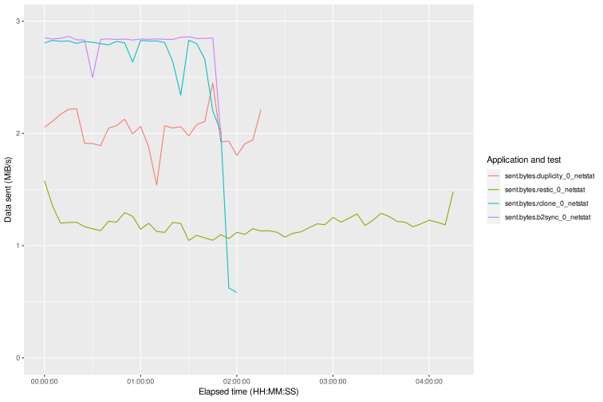
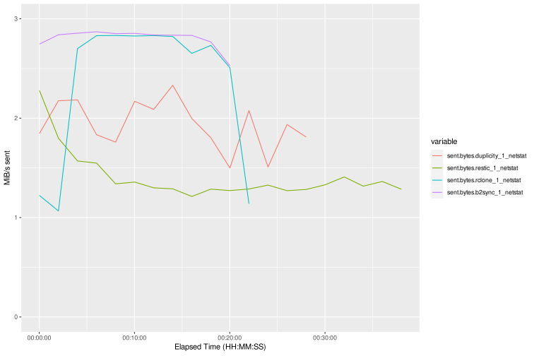

This is the third part in my deep dive series on cloud backup for network attached storage (NAS). I'll share the results of my tests and comment on the benefits and drawbacks of each backup client.

<!--more-->

These are the variables I'm measuring:
* Time
* Network usage
* Size on disk

### Time Results

The following table shows how long the test cases took with each application. Times are in HH:MM:SS format with the winner of each test bolded.

| Test           | Duplicity    | Restic       | Rclone   | B2 sync      |
|:---------------|:-------------|:-------------|:---------|:-------------|
| Initial backup | 02:17:04     | 04:16:41     | 02:04:29 | **01:54:14** |
| Add files      | 00:28:45     | 00:39:40     | 00:23:45 | **00:20:13** |
| Modify files   | **00:00:57** | **00:01:53** | 00:17:31 | 00:16:24     |
| Touch one file | **00:00:20** | **00:00:19** | 00:04:42 | 00:04:41     |
| Remove files   | 00:00:08     | 00:00:12     | 00:04:36 | **00:00:07** |
| Full restore   | 00:35:22     | 00:12:04     | 00:11:57 | **00:08:11** |

All the tools except for Restic ran fast enough to saturate my 30 mbit/s upload connection at least some of the time.

Rclone and b2-sync were the fastest at moving files overall, but the Modify and Touch tests show the shortcomings of a simple file-based sync. Duplicity and restic completed those tests very quickly (and used less bandwidth and storage), because they send only the changed blocks in a file, not the whole file.

Obviously, the b2-sync utility is very fast. I suspect Rclone is more resilient to network issues, and it has a lot of tunable options. Still, it's hard to recommend Rclone over b2-sync for a file-based sync to a B2 bucket.

### Size on Disk Results

This table shows the size of the B2 bucket in gigabytes after each test.

| Test           | Duplicity   | Restic      | Rclone  | B2 sync |
|:---------------|:------------|:------------|:--------|:--------|
| Initial backup | **17 GB**   | 18.7 GB     | 19.5 GB | 19.4 GB |
| Add files      | **20.3 GB** | 22.2 GB     | 22.9 GB | 22.9 GB |
| Modify files   | **20.3 GB** | 22.4 GB     | 25.5 GB | 25.4 GB |
| Touch one file | **20.4 GB** | **22.4 GB** | 25.5 GB | 26.2 GB |
| Remove files   | **20.4 GB** | 22.4 GB     | 25.7 GB | 26.5 GB |

Duplicity was the most space-efficient across all tests. I considered the Touch test a tie between Duplicity and restic because the reported size wasn't precise enough to tell.

The restic container takes up a little more space the Duplicity container, which matches what Gilbert Chen, the author of a competing product, found in [his benchmarks](https://github.com/gilbertchen/benchmarking). However, the difference is very small in this test, so I have to assume that the restic developers have the issue he saw back in 2017.

### Network Usage Results
The following graphs show network usage over time in MiB (1024 bytes) per second. The file-based sync tools easily saturated my 30 mbit/s upload connection, but duplicity and restic either had other resource bottlenecks or chose to limit the upload rate.

I likely do need to limit upload bandwidth. Given that it took two hours to back up 20 GB, an incremental backup of something like Time Machine backups or 4K video might still be running during daytime hours and could disrupt other work. Rclone and restic offer options to limit the upload rate, while B2-sync and duplicity need a separate utility to do so.

#### Test 0. Initial backup

#### Test 1. Add files

#### Test 2. Modify files

For this test, I modified one attribute in the metadata of a batch of large TIFF files. I liked that the b2-sync line had one little bump for each file!

#### Test 3. Touch one file

This test shows a scenario where Rclone might be better than b2-sync. I touched just the modify date of a single large MP4 video. Rclone and b2-sync took a similar amount of time reading the file for changes, but Rclone didn't actually send it.

#### Test 4. Remove files

#### Test 5. Restore

Duplicity used less bandwidth but took much longer to restore than the other applications. In a restore scenario, using less bandwidth is probably not a benefit. If you have to do a full restore, the goal is to get up and running quickly, not minimize disruption on the network.

### Selected CPU and Memory Usage Results

The CPU and memory usage graphs for the initial backup might help explain why restic didn't saturate the upload connection.

#### Test 0. Initial backup

Restic seems to use system resources in a more predictable way than the other applications. It uses a moderate amount of CPU and grabs a block of memory that stays consistent for the whole time it takes to run.

I don't see this result as a drawback for restic, especially because it has tuneable options for IO and CPU priority. However, it's worth noting that the out-of-the-box configuration might not be what people expect if they're used to other applications.

The CPU result for restic also differs from [Gilbert Chen's benchmarks](https://github.com/gilbertchen/benchmarking), so maybe the restic developers changed the CPU handling based on his comments. Either way, I don't fully agree with Chen's reasoning for preferring lower CPU—I think it depends—and it's worth noting that Chen's product stands to benefit if restic seems clunky.

### Conclusion

You can implement a successful cloud backup strategy using any of these applications. Both Duplicity and restic have features that appeal to me: I like that Duplicity uses GPG for encryption, and I like that restic doesn't require periodic full backups. I'd like to try one or both of them on my production dataset.

One recommendation I can give: I found it very useful and interesting to do hands-on testing before trusting an application with my important data. If you found these articles helpful and want to recreate my tests, check out my GitHub repo here: [neapsix/cloudbackup-benchmarks](https://github.com/neapsix/cloudbackup-benchmarks).
